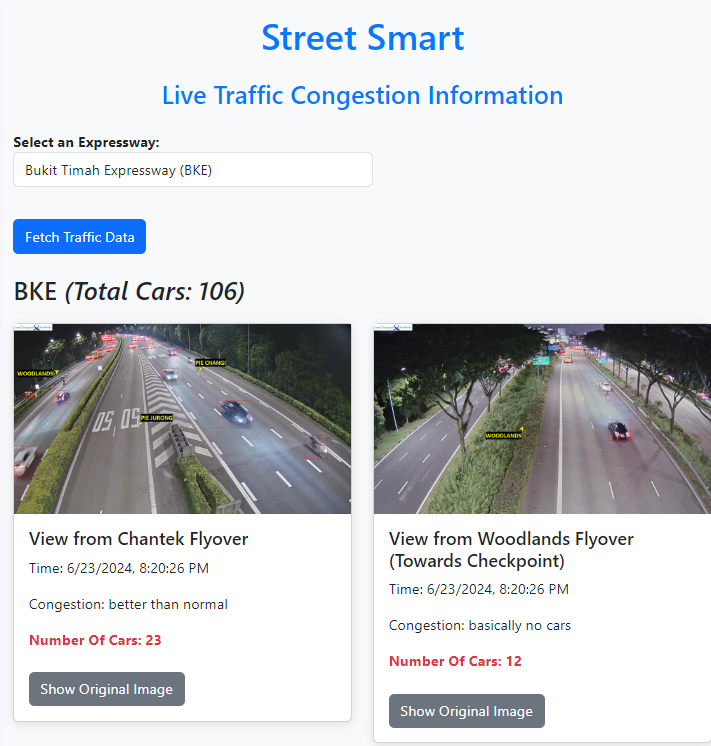

# Project Street Smart: Real-Time Traffic Congestion Detection

This project uses Hugging Face AI zero-shot object detection to analyse real-time traffic images, from `Data.gov.sg`, and count the number of cars, determining the congestion level of a particular expressway. The project is built for the CloudHacks Hackathon 2024 and utilises a Flask Python backend and a React + Vite frontend. The project also leverages `ThreadPoolExecutor` for asynchronous requests to the Hugging Face API.



_This project won 1st runner-up in the CloudHacks Hackathon 2024_

## Table of Contents

- [Project Overview](#project-overview)
- [Tech Stack](#tech-stack)
- [Features](#features)
- [Installation](#installation)
- [Usage](#usage)

## Project Overview

The objective of this project is to provide real-time traffic congestion information by analysing traffic images using Hugging Face AI. The system counts the number of cars in the images and determines the congestion level of different expressways. This information is then presented in a user-friendly web interface.

## Tech Stack

- **Backend**: Flask, Python
- **Frontend**: React, Vite
- **AI Model**: Hugging Face Zero-Shot Object Detection (supported by OWL-ViT (Vision Transformer for Open-World Localization))
- **Concurrency**: `ThreadPoolExecutor`

## Features

- Real-time traffic image analysis
- Car counting using AI
- Congestion level determination
- Interactive web interface for displaying traffic data
- Asynchronous API calls for efficient processing

## Installation

### Prerequisites

- Python 3.11.5
- Node.js and npm
- Flask
- Vite
- Hugging Face's transformers module

### Backend Setup

1. Clone the repository:

   ```bash
   git clone https://github.com/yourusername/traffic-congestion-detection.git
   cd src
   ```

2. Create a virtual environment and activate it:

   ```bash
   python -m venv venv
   source venv/bin/activate  # On Windows, use `venv\Scripts\activate`
   ```

3. Install the required packages:

   ```bash
   pip install -r requirements.txt
   ```

4. Start the backend flask server:
   ```bash
   python app.py
   ```

### Frontend Setup

1. Navigate to the frontend directory:

   ```bash
   cd ../frontend
   ```

2. Install the required packages:

   ```bash
   npm install
   ```

3. Start the Vite development server:
   ```bash
   npm run dev
   ```

## Usage

1. Open your browser and go to http://localhost:5173 to access the frontend.

2. Select an expressway from the dropdown and click "Fetch Traffic Data".

3. View real-time traffic congestion information and toggle between original and annotated images.
